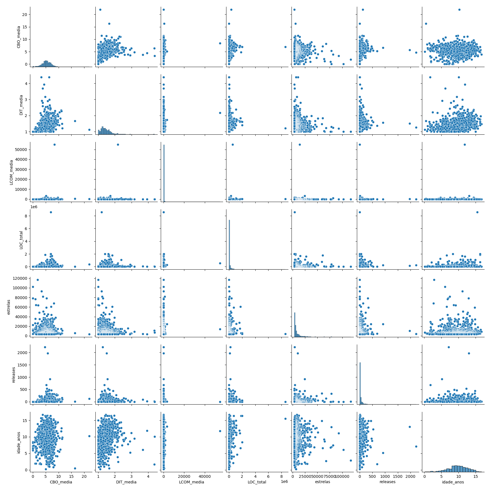

# Relatório Final – Estudo das Características de Qualidade em Repositórios Java

## Introdução
O estudo teve como objetivo analisar a qualidade interna de repositórios Java a partir de métricas coletadas com a ferramenta **CK**. Além das métricas de qualidade (CBO, DIT, LCOM), foram coletados dados de processo no GitHub (popularidade, atividade e maturidade).

**Hipóteses iniciais:**
- Repositórios mais populares tenderiam a apresentar maior complexidade (CBO mais alto) devido ao tamanho do código.
- Projetos mais maduros deveriam ter melhor coesão (LCOM menor) por passarem por refatorações ao longo do tempo.
- Projetos mais ativos (mais releases) teriam maior profundidade de herança (DIT) pela evolução contínua.

---

## Metodologia
1. **Seleção dos repositórios**: foram analisados 993 repositórios Java do GitHub.
2. **Coleta de métricas de qualidade**: com a ferramenta CK, foram extraídas métricas de classes e sumarizadas por repositório.
   - **CBO** (acoplamento entre objetos)
   - **DIT** (profundidade de herança)
   - **LCOM** (falta de coesão)
   - **LOC** (linhas de código)
3. **Coleta de métricas de processo**: com a API do GitHub.
   - **Popularidade**: número de estrelas
   - **Atividade**: número de releases
   - **Maturidade**: idade em anos do repositório

---

## Resultados

### Estatísticas descritivas
As métricas foram agregadas em média, mediana e desvio padrão por repositório.
Exemplo (trecho do `resultado_final.csv`):

| Repositório                            | CBO_media | DIT_media | LCOM_media | LOC_total | Estrelas | Releases | Idade (anos) |
|----------------------------------------|-----------|-----------|------------|-----------|----------|----------|--------------|
| krahets_hello-algo                     | 1.87      | 1.00      | 4.70       | 7,707     | 117,036  | 9        | 2.88         |
| GrowingGit_GitHub-Chinese-Top-Charts   | 0.00      | 1.00      | 0.00       | 5         | 102,419  | 0        | 6.05         |
| iluwatar_java-design-patterns          | 3.36      | 1.20      | 1.84       | 35,484    | 92,713   | 0        | 11.12        |
| macrozheng_mall                        | 3.93      | 1.24      | 1110.80    | 100,903   | 81,625   | 3        | 7.47         |
| spring-projects_spring-boot            | 5.37      | 1.29      | 12.61      | 373,644   | 78,446   | 323      | 12.93        |

---

### Visualização dos dados
Os gráficos de correlação permitem observar os padrões entre as métricas de qualidade e de processo:

---

### Correlações Estatísticas

#### Pearson
|              | CBO_media | DIT_media | LCOM_media | LOC_total | Estrelas | Releases | Idade_anos |
|--------------|-----------|-----------|------------|-----------|----------|----------|------------|
| **CBO_media** | 1.00      | 0.29      | 0.07       | 0.17      | -0.11    | 0.15     | 0.00       |
| **DIT_media** | 0.29      | 1.00      | 0.07       | 0.05      | -0.11    | 0.04     | 0.19       |
| **LCOM_media**| 0.07      | 0.07      | 1.00       | 0.05      | 0.02     | -0.01    | 0.03       |
| **LOC_total** | 0.17      | 0.05      | 0.05       | 1.00      | 0.05     | 0.07     | 0.12       |
| **Estrelas**  | -0.11     | -0.11     | 0.02       | 0.05      | 1.00     | 0.08     | -0.02      |
| **Releases**  | 0.15      | 0.04      | -0.01      | 0.07      | 0.08     | 1.00     | -0.00      |
| **Idade**     | 0.00      | 0.19      | 0.03       | 0.12      | -0.02    | -0.00    | 1.00       |

#### Spearman
|              | CBO_media | DIT_media | LCOM_media | LOC_total | Estrelas | Releases | Idade_anos |
|--------------|-----------|-----------|------------|-----------|----------|----------|------------|
| **CBO_media** | 1.00      | 0.39      | 0.37       | 0.41      | 0.03     | 0.40     | 0.00       |
| **DIT_media** | 0.39      | 1.00      | 0.36       | 0.29      | -0.04    | 0.22     | 0.29       |
| **LCOM_media**| 0.37      | 0.36      | 1.00       | 0.49      | 0.04     | 0.32     | 0.20       |
| **LOC_total** | 0.41      | 0.29      | 0.49       | 1.00      | 0.13     | 0.41     | 0.13       |
| **Estrelas**  | 0.03      | -0.04     | 0.04       | 0.13      | 1.00     | 0.13     | 0.07       |
| **Releases**  | 0.40      | 0.22      | 0.32       | 0.41      | 0.13     | 1.00     | -0.01      |
| **Idade**     | 0.00      | 0.29      | 0.20       | 0.13      | 0.07     | -0.01    | 1.00       |

---

## Discussão

- **RQ01 – Popularidade vs. Qualidade:**
  As correlações foram fracas (Pearson ≈ -0.11, Spearman ≈ 0.03). Isso mostra que a popularidade (estrelas) não tem relação direta com CBO, DIT ou LCOM.

- **RQ02 – Maturidade vs. Qualidade:**
  A maturidade apresentou correlação baixa, mas positiva com DIT (Spearman ≈ 0.29), indicando que projetos mais antigos podem adotar hierarquias de herança mais complexas.

- **RQ03 – Atividade vs. Qualidade:**
  Releases correlacionaram positivamente com CBO (Spearman ≈ 0.40), sugerindo que projetos mais ativos podem ter maior acoplamento.

- **RQ04 – Tamanho vs. Qualidade:**
  LOC teve correlação moderada com CBO e LCOM (Spearman ≈ 0.41–0.49), confirmando que projetos maiores tendem a apresentar mais acoplamento e menor coesão.

---

## Conclusão
A análise mostrou que:
- Popularidade não influencia diretamente a qualidade interna.
- Maturidade tem impacto leve em estruturas de herança.
- Atividade está associada a maior acoplamento.
- Tamanho está fortemente ligado a acoplamento e coesão.

**Trabalhos futuros**: explorar modelos preditivos e análises longitudinais (evolução histórica) para verificar como essas métricas mudam ao longo do tempo.
